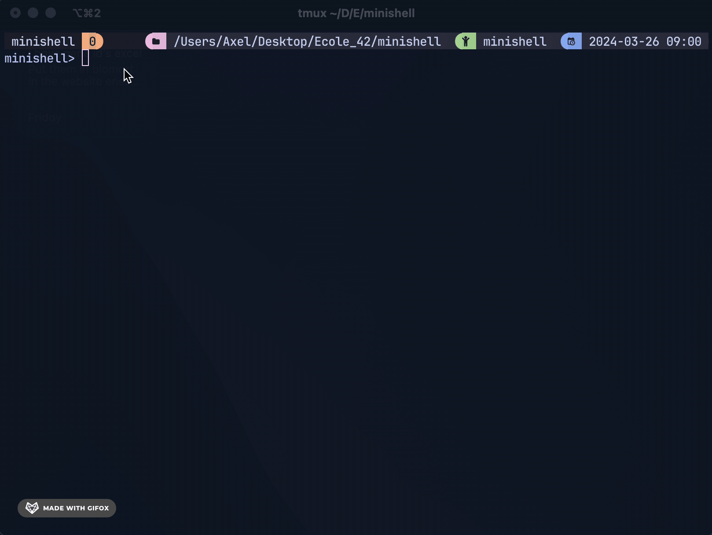

# About
Minishell is an implementation of a bash like shell that support all bash commands, output redirection, heredoc and command piping. Find a detailed list of requirements for this project here: [subject.pdf](https://github.com/Axel-ex/Minishell/blob/main/subject.pdf)

# Usage
`git clone` this project `cd` into it and `make`.
the program is executed as so:

```shell
./minishell
```
The program will then prompt you for input. It is used exactly as a bash shell.

# Implementation
The program uses the readline library to prompt input to the user. the input is parsed into a list of tokens each holding a part of the input and an associated type. Synthax is checked using abastract synthax rules. Tokens are then parsed into an Abstract Synthax Tree (link) that will allow us to execute commands while taking into account input/output redirection.
<br/>



# Testing
`cd` into the test/ directory and run `./tester`. The tester was developed by Lucas Kuhn ([minishell tester](https://github.com/LucasKuhn/minishell_tester)) and was really usefull to rigouresly test for errors. Tests can be added in the "test/extras" file to cover more aspects of the shell.